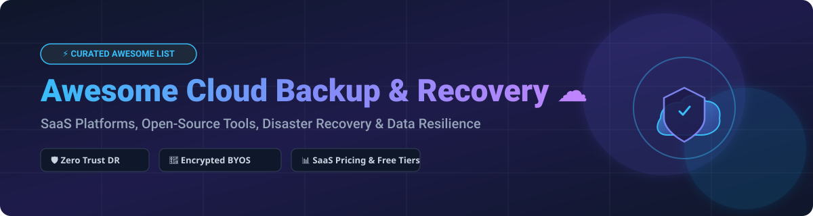

  

# Awesome Cloud Backup & Recovery ☁️ 🛡️ 💾

  
  
  
  

**Curated List of SaaS Platforms & Open-Source GitHub Projects**  
*Focused on Enterprise Cloud Backup, Disaster Recovery (DR), Ransomware Protection, Zero-Trust Storage & Data Resilience*

---

## 🚀 Overview & Key Highlights

This repository tracks notable **SaaS platforms** and **open-source projects** for **Cloud Backup & Recovery**. These tools help organizations protect workloads across on-premises, cloud-native, and SaaS environments—from Virtual Machine (VM) backup and Kubernetes disaster recovery to Microsoft 365, Google Workspace, and cloud object storage protection.

- **Enterprise Commercial SaaS Leaders**: Managed enterprise solutions offering centralized management consoles, automated SLAs, immutable zero-trust backups, ransomware detection, and compliance governance.
- **Production-Grade Open-Source Tools**: High-performance CLI and GUI tools featuring client-side encryption, lock-free deduplication, and Bring Your Own Storage (BYOS) support for S3, Azure Blob, and Backblaze B2.

---

## 📖 Table of Contents

- [☁️ SaaS/Hosted Platforms](#-saashosted-platforms)
- [🔓 Open-Source GitHub Projects](#-open-source-github-projects)
- [🤝 How to Contribute](#-how-to-contribute)
- [💖 Support & Sponsorship](#-support--sponsorship)
- [📈 Star History](#-star-history)
- [⚠️ Disclaimer](#-disclaimer)

---

## ☁️ SaaS/Hosted Platforms

> **📊 Market Context & Sector Structure**: The global cloud backup and recovery market is estimated at **~$15.6B in 2026**, growing toward **~$38.5B by 2031** at a **~19.8% CAGR** (Mordor Intelligence / MarketsandMarkets estimates). The enterprise tier is **moderately concentrated**—dominated by top-tier vendors like AWS, Microsoft, Veeam, Cohesity (post-Veritas EDP merger), Rubrik, and Commvault. The market features high barrier-to-entry enterprise suites alongside high-growth SaaS offerings, while avoiding a winner-take-all monopoly due to diverse multi-cloud and hybrid workload requirements.

SaaS products below are sorted by **Company Size / Valuation (Descending)**:

| Platform | Description | Pricing (Starting Tier) | Free Tier Limits | Company Size / Valuation |
|:---|:---|:---|:---|:---|
| **[AWS Backup](https://aws.amazon.com/backup/)** ☁️ | Centralized backup service for AWS services (EBS, RDS, EFS, DynamoDB, S3, EC2). | **Warm storage**: **$0.05/GB/month** (EBS/EFS); **Cold storage**: **$0.01/GB/month**. Restore: **$0.02/GB**. | **100 GB warm storage free for 12 months** (via AWS Free Tier); no perpetual free tier. | **~$638B revenue (Amazon FY2025)** |
| **[Azure Backup](https://azure.microsoft.com/en-us/products/backup/)** 🔷 | Microsoft's enterprise cloud backup service for Azure VMs, SQL, SAP HANA, on-prem servers, and M365. | **Azure VM**: From **$5/month** (instance fee for VM < 50GB) + storage ($0.0224/GB/mo); **M365 Backup**: **$0.15/GB/month**. | **10 GB backup storage free for 12 months** (via Azure Free Account); no perpetual free tier. | **~$281B revenue (Microsoft FY2025)** |
| **[Cohesity DataProtect](https://www.cohesity.com/)** 🛡️ | Unified data protection and cyber resilience for databases, VMs, and SaaS. Post-merger with Veritas EDP. | **DataProtect SaaS**: From **~$29,100/year** (10 BETB entry pack on AWS Marketplace); **On-prem**: **~$150–$400/TB/year**. | **30-day free trial** available (DPaaS virtual edition request via sales). | **$5B–$10B valuation est., $1B–$5B combined revenue** |
| **[Veeam Cloud Connect](https://www.veeam.com/)** ⚡ | Multi-tenant backup and DRaaS platform for service providers and hybrid cloud enterprises. | **Veeam Universal License (VUL)**: From **~$180/workload/year** ($15/workload/month, 10-pack min). | **Free forever up to 10 workloads** (Veeam Community Edition); unlimited ad-hoc VeeamZIP backups. | **~$2.0B backup revenue, ~22.7% leading market share** |
| **[Rubrik](https://www.rubrik.com/)** 🔐 | Zero Trust Data Security platform providing cyber recovery, immutable backups, and data governance. | **Foundation Edition list**: From **~$130/BETB/month**; **Business Edition**: **~$163/BETB/month**. Quote required. | **30-day free trial** (M365 up to 500 users / 10TB; Google Workspace up to 10 users / 500GB). | **$1.57B backup revenue est., $1.32B audited total (FY2026)** |
| **[Commvault Cloud](https://www.commvault.com/)** 🏢 | Enterprise cloud-native data protection SaaS platform powered by Metallic AI engine. | **M365 Backup**: From **$1.70/user/month**; **Endpoint**: From **$7.50/user/month**; **File/Object**: From **$58.50/TB/month**. | **30-day free trial** (includes **30,000 trial credits** on cloud marketplaces). | **$1.18B total revenue (FY2026), SaaS ARR $333M (+52% YoY)** |
| **[Acronis Cyber Protect](https://www.acronis.com/)** 🛡️ | All-in-one cyber protection combining cloud backup, disaster recovery, and endpoint security. | **Standard**: From **~$85/year** (up to 5 devices); **Advanced**: From **~$129/year**. MSP per-device: **€4.42/month** (workstation). | **30-day free trial** available (full feature evaluation, no perpetual consumer free tier). | **Private (Acronis est. ~$500M+ revenue, $3.5B+ valuation)** |
| **[Druva inSync](https://www.druva.com/)** ☁️ | Cloud-native 100% SaaS data protection for endpoints, Microsoft 365, Google Workspace, and Salesforce. | **Endpoint/SaaS**: Enterprise plans start at **~$8–$12/user/month** (typical entry commitment); quote required. | **30-day free trial** (extendable up to 60 days; full feature access, no credit card required). | **Private (~$2B valuation est., $500M+ raised)** |
| **[Backblaze B2](https://www.backblaze.com/cloud-storage)** 📦 | Low-cost, high-performance S3-compatible cloud object storage for backups and archive retention. | **Storage**: **$6.95/TB/month** ($0.00695/GB/month). **Egress**: Free up to **3x monthly avg storage**, then **$0.01/GB**. API calls: **Free**. | **First 10 GB storage free forever**; 1,000 Class A & 10,000 Class B API calls/day free. | **Public (NASDAQ: BLZE), ~$100M+ ARR** |
| **[HYCU](https://www.hycu.com/)** 🔌 | Purpose-built Multi-Cloud & SaaS Data Protection as a Service (R-Cloud platform). | **Starter Bundle**: From **$5,000/year** (<100 employees, up to 50 VMs / 10TB data / 100 SaaS users). | **14-day free trial** for Azure SaaS; **30-day trial** for enterprise/R-Cloud modules. | **Private (~$100M+ raised)** |

---

## 🔓 Open-Source GitHub Projects

Cloud backup & recovery features a mature, production-proven open-source ecosystem. Projects below are sorted by **GitHub Stars_Count (Descending)**:

| Repo | Description | GitHub_Stars |
|:---|:---|:---:|
| **[Rclone](https://github.com/rclone/rclone)** 🚀 | "rsync for cloud storage" — command-line tool managing files across 70+ cloud providers (S3, B2, GCS, Azure, Drive). Supports encryption, caching, and mount. MIT. |  |
| **[Restic](https://github.com/restic/restic)** 🔒 | Fast, secure, deduplicating backup program using AES-256 encryption. BYOS support for S3, B2, Azure Blob, SFTP, and local storage. BSD-2-Clause. |  |
| **[BorgBackup](https://github.com/borgbackup/borg)** 📦 | Deduplicating backup program with authenticated encryption and compression. Optimized for Linux servers and homelabs. BSD-3-Clause. |  |
| **[Duplicati](https://github.com/duplicati/duplicati)** 🌐 | Free, open-source backup client with web-based GUI. Features zero-trust AES-256 encryption, incremental backups, and cloud storage sync. LGPL-2.1. |  |
| **[Velero](https://github.com/vmware-tanzu/velero)** ☸️ | Industry-standard Kubernetes backup, restore, and disaster recovery tool for cluster resources and persistent volumes. Apache-2.0. |  |
| **[Kopia](https://github.com/kopia/kopia)** ⚡ | Fast and secure open-source backup tool with lock-free deduplication, client-side encryption, and CLI/GUI interfaces. BYOS supported. Apache-2.0. |  |
| **[Duplicacy](https://github.com/gilbertchen/duplicacy)** 🔑 | Lock-free cross-computer deduplication backup engine. Supports S3, B2, Wasabi, GCS, and Azure Blob. Free for personal use. |  |
| **[UrBackup](https://github.com/uroni/urbackup_backend)** 🖥️ | Client/server Open Source backup system combining file and image backups for Windows, Linux, and macOS endpoints. GPL-3.0. |  |
| **[Backrest](https://github.com/garethgeorge/backrest)** 🐳 | Docker-native Web UI orchestrator and web interface for Restic backups with built-in cron scheduling and health monitoring. GPL-3.0. |  |
| **[Borgmatic](https://github.com/borgmatic-collective/borgmatic)** ⚙️ | Simple, declarative YAML configuration-driven wrapper for BorgBackup with automated database hooks (PostgreSQL, MySQL). GPL-3.0. |  |
| **[Kanister](https://github.com/kanisterio/kanister)** 🪣 | CNCF sandbox project for application-level data management on Kubernetes with pre-built blueprints for PostgreSQL, MySQL, and MongoDB. Apache-2.0. |  |
| **[Stash](https://github.com/stashed/stash)** ⚓ | Cloud-native, GitOps-friendly Kubernetes backup and restore operator powered by Restic. Apache-2.0. |  |
| **[Déjà Dup](https://gitlab.gnome.org/World/deja-dup)** 🐧 | Simple desktop backup utility integrated into GNOME desktop environments, backed by Restic/Duplicity engine. GPL-3.0. |  |

---

## 🤝 How to Contribute

Contributions are warmly welcome! Please follow these simple steps:

1. **Fork** the repository.
2. **Add/Edit** entries in `README.md` following the established table structure.
3. Ensure entries include product name, official website/repo link, clear description, pricing tier, and free limits.
4. **Submit a Pull Request** with a concise description of your additions.

---

## 💖 Support & Sponsorship

If you find this repository helpful for your infrastructure engineering, SRE workflows, or backup administration, please consider supporting the project:

- ⭐ **Star** this repository to help others discover it!
- 🔀 **Fork** and share with your DevOps/Infra team.
- ☕ **Buy me a coffee**: Support open-source curation on GitHub Sponsors:

  

Thank you for supporting open-source software and transparent cloud tooling! 🙏

---

## 📈 Star History

---

## ⚠️ Disclaimer

- This list is **community-curated** for informational purposes and does not represent a commercial endorsement.
- Ensure strict compliance with local data sovereignty laws (GDPR, HIPAA, SOC 2) when provisioning cloud backup solutions.
- Commercial SaaS solutions provide managed SLAs, single-pane governance, and ransomware monitoring, whereas open-source tools offer BYOS independence with zero licensing cost but require custom operational management.

---

  <b>Made with ❤️ for Infrastructure Engineers, SREs, Systems Administrators &amp; Data Protection Teams.</b>

